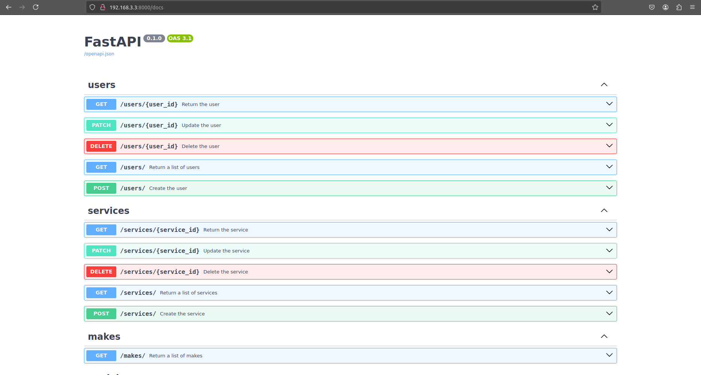
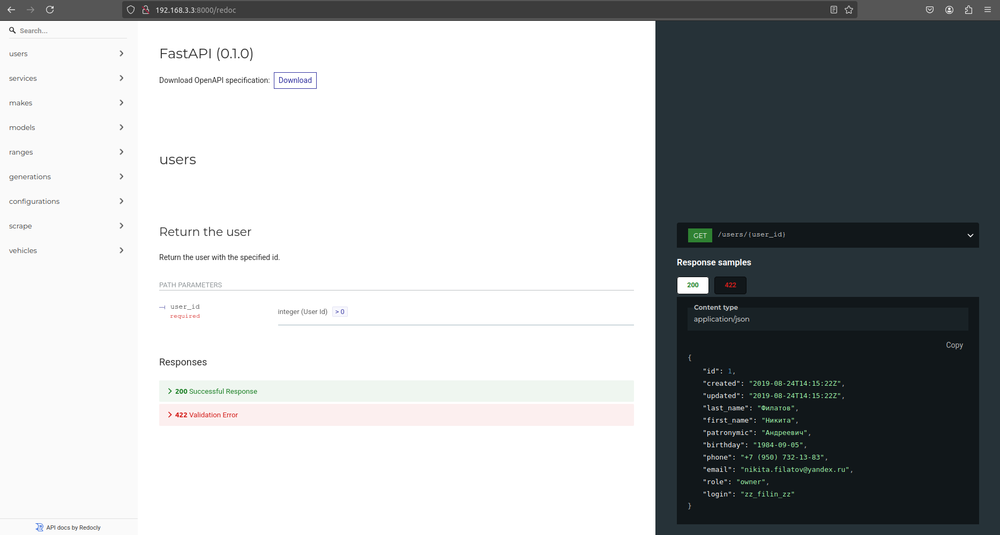

# Vehicles maintenance data API

REST API that provides both vehicle owners and vehicle services with the ability to efficiently manage maintenance data 
for passenger cars and trucks. 

With this API, vehicle owners can conveniently enter information about work performed, such as oil changes, diagnostics, 
filter changes and other services, as well as view their vehicle's maintenance history. Vehicle services can manage data 
about customers' vehicles maintenance, record services rendered and invoicing.

## Table of contents
- [Technology stack and features](#technology-stack-and-features)
- [Installation](#installation)
- [Launching](#launching)
- [Documentation](#documentation)
- [Shutdown](#shutdown)

## Technology stack and features

🚀 **FastAPI** for the API on Python:
- **Pydantic** for data validation, ensuring that incoming data adheres to specified types and formats;
- **Uvicorn** as the ASGI server for optimal performance, allowing for asynchronous handling of requests, 
which increases the speed of the application.
 
🐘 **PostgreSQL** as the database:
- **SQLAlchemy** for database interactions by ORM queries, making it easier to work with the database through Python 
objects and minimizing the writing of SQL queries;
- **Alembic** for database migrations, allowing you to manage changes to the database structure and easily roll back 
migrations when needed.

🚗 **Web scraping to extract data about vehicles**:
- **Requests** for making HTTP requests to fetch content from the drom.ru website;
- **BeautifulSoup** for parsing HTML and extracting data.

🐳  **Docker** for development:
- **separate containers** for FastAPI and PostgreSQL;
- **Docker compose** to simplify running dependent containers;
- **Docker volume** for storing the database between container restarts. 

🔒 **Password hashing** for storing user credentials safely:
- **Bcrypt** for password hashing using **salt**;
- protect stored passwords from **rainbow table attacks**. 

🔖 **Automatically generated documentation** with FastAPI's integrated tools:
- the documentation is available through the **Swagger** and **ReDoc** interfaces, allowing users to easily explore and test 
your API endpoints.

## Installation

Clone the repository to a folder on your local machine.

```bash
cd PyCharmProjects
git clone git@github.com:Panovky/vehicles-maintenance-data-api.git VehiclesMaintenanceDataAPI
```

## Launching

### Step 1

Check if Docker and Docker Compose are installed by running the following commands:

```bash
docker --version
docker-compose --version
```

If both commands return versions, then they are installed. If not, install them on the local machine.

### Step 2

Copy the contents of .env.example into .env and populate it with specific data to run your application.

```bash
cd VehiclesMaintenanceDataAPI
cp .env.example .env
```

### Step 3

Start the containers using docker-compose from the project folder:

```bash
docker-compose up
```

When containers are built, all necessary dependencies will be automatically installed and database migrations will be 
applied. Docker will create a volume to store the database, allowing data to be saved between container restarts.

Changes in the src and migrations folders are tracked automatically and do not require rebuilding the containers. 

### Step 4

The running application will be available:

- locally on your computer at http://localhost:8000 or http://127.0.0.1:8000;

- on other devices on the same network to which the local machine is connected, by the IP address of the local machine on that network, e.g. http://192.168.1.3:8000. 

You can find your local IP address using the ipconfig (Windows) or ifconfig (Linux) command in the terminal.

## Documentation

FastAPI automatically generates documentation for the API based on routes and type annotations. 
Once your application is running, you can access the API documentation at the following addresses:

- http://0.0.0.0:8000/docs for Swagger UI:



- http://0.0.0.0:8000/redoc for ReDoc:

 

## Shutdown

To stop the application, you must stop the containers using the docker-compose command:

```bash
docker-compose down
```